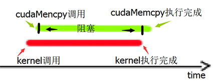

## 目录
#### - [优化说明](#optimization)
- [version 1.0](#v1)
#### - [优化结果](#result)
#### - [执行指令](#shell)

<div id="optimization"> </div>

## 优化说明

<div id="v1"> </div>

## version 1.0

在优化作业中，我首先尝试以最简单的做法利用 GPU 并行加速 C63 编码器，作为 CUDA C 编程初次尝试。在此版本中，我将运动估计用到的当前帧、参考帧、每一宏块记录参考帧中最相似块位置的结构体 mbs (macroblock) 及其他参数从 host 传入 device，将设备的 Grid 划分为 (width/8, height/8) 个 Block，每个 Block 8\*8 个 Thread，即一个 Grid 处理一张图像大小的数据，每个 Block 对一个宏块与参考帧求 SAD（绝对差的总和）。global 函数中以循环的形式遍历参考帧中的宏块寻找最相似的宏块，因此程序仍需要 width\*height 次数的串行 SAD 操作。在运动估计 kernel（核函数） 中，关键操作如下：

```c
for (y=top; y<bottom; ++y)
{
    for (x=left; x<right; ++x)
    {
        __shared__ uint8_t sad_block[8][8];

        int row = blockIdx.y*blockDim.y+threadIdx.y;
        int col = blockIdx.x*blockDim.x+threadIdx.x;
        
        sad_block[threadIdx.y][threadIdx.x] = abs(*(orig+row*w+col) - 
                                                *(ref+(y+threadIdx.y)*w+x+threadIdx.x));
        
        // 同步点：等待所有线程完成数据计算
        __syncthreads();
        int i,j;
        int sad = 0;

        for (i=0; i<8; ++i)
        {
            for (j=0; j<8; ++j)
                sad += sad_block[i][j];
        }

        if (sad < best_sad)
        {
            mb->mv_x = x - mx;
            mb->mv_y = y - my;
            best_sad = sad;
        }
    }
}
```

数据拷贝和核函数调用的主要操作如下：

```c
extern "C" void me_block_cuda(struct c63_common *cm, uint8_t *orig_host, uint8_t *ref_host, int cc)
{
    struct macroblock *mbs;
    uint8_t *orig, *ref;
    
    ...
        
    cudaMalloc((void **)&mbs, size_mbs);
    cudaMalloc((void **) &orig, size_orig);
    cudaMalloc((void **) &ref, size_ref);
    // cudaMemcpy(mbs, cm->curframe->mbs[cc], size_mbs, cudaMemcpyHostToDevice);
    cudaMemcpy(orig, orig_host, size_orig, cudaMemcpyHostToDevice);
    cudaMemcpy(ref, ref_host, size_ref, cudaMemcpyHostToDevice);

    int grid_x = cc>0 ? cm->mb_cols/2:cm->mb_cols;
    int grid_y = cc>0 ? cm->mb_rows/2:cm->mb_rows;
    dim3 dimGrid(grid_x, grid_y);
    dim3 dimBlock(8,8);

    me_kernel<<<dimGrid, dimBlock>>>(cm->padw[cc], cm->padh[cc], mbs, 
                                    cm->me_search_range, orig, ref, cc);
    cudaMemcpy(cm->curframe->mbs[cc], mbs, size_mbs, cudaMemcpyDeviceToHost);

    cudaFree(mbs);
    cudaFree(orig);
    cudaFree(ref);
}
```

经测试，在这一版代码优化后，对 foreman 文件的处理时间由 33s 左右缩短为 15s 左右，对 tractor 文件的处理时间由 1756s 左右缩短为 705s 左右，加速比约为 2.3 倍。利用 nvprof 工具可以看到如下结果：

```shell
==27503== Profiling application: ./c63enc -w 352 -h 288 -o tmp/FOREMAN_352x288_30_orig_01.c63 /home/FOREMAN_352x288_30_orig_01.yuv
==27503== Profiling result:
Time(%)      Time     Calls       Avg       Min       Max  Name
 99.82%  11.7943s       891  13.237ms  2.2198ms  35.740ms  me_kernel(int, int, macroblock*, int, unsigned char*, unsigned char*, int)
  0.15%  18.194ms      1782  10.209us  5.4400us  28.672us  [CUDA memcpy HtoD]
  0.03%  3.0515ms       891  3.4240us  2.8160us  12.928us  [CUDA memcpy DtoH]

==27503== API calls:
Time(%)      Time     Calls       Avg       Min       Max  Name
 94.09%  11.8940s      2673  4.4497ms  17.819us  35.768ms  cudaMemcpy
  4.07%  514.13ms      2673  192.34us  5.2330us  256.77ms  cudaMalloc
  1.68%  211.95ms      2673  79.293us  8.5030us  240.43us  cudaFree
  0.14%  18.064ms       891  20.273us  16.660us  70.511us  cudaLaunch
  0.01%  1.7381ms      6237     278ns     168ns  14.858us  cudaSetupArgument
  0.01%  972.22us       166  5.8560us     245ns  214.43us  cuDeviceGetAttribute
  0.00%  597.45us       891     670ns     487ns  12.756us  cudaConfigureCall
  0.00%  161.76us         2  80.881us  58.010us  103.75us  cuDeviceTotalMem
  0.00%  90.792us         2  45.396us  43.837us  46.955us  cuDeviceGetName
  0.00%  4.7840us         2  2.3920us  1.0270us  3.7570us  cuDeviceGetCount
  0.00%  2.0290us         4     507ns     284ns     714ns  cuDeviceGet
```

由于 kernel 的调用是异步的，调用 kernel 后不久主机线程就会获得控制，这样一来下一个 cudaMemcpy 会在 kernel 完成执行前启动。 而 cudaMemcpy 会阻塞等待 kernel 的结果，直到 kernel  执行结束才进行数据传输并返回。如图1所示：



图1 核函数和 cudaMemcpy 调用示意

因此在以上结果中 API calls 显示 cudaMemcpy 占用了相近于 Profiling result 中核函数调用的时间，就是因为 cudaMemcpy 阻塞了将近一整个核函数执行的时间。从 Profiling result 的结果可以看出，核函数执行的时间一共为 11.7943s 用了绝大部分，而数据传输事实上只有几个毫秒。

在这一版本中，数据处理的并行度较低，利用的 GPU 计算资源较少，导致 CPU 存在非常大的性能浪费。目前瓶颈仍非常明显地在计算部分，而非数据传输。因此需要考虑更好的并行化方法。

此外，注意到代码中有一行注释行：

```c
// cudaMemcpy(mbs, cm->curframe->mbs[cc], size_mbs, cudaMemcpyHostToDevice);
```

一开始，将每一宏块记录参考帧中最相似块位置的结构体 mbs (macroblock) 也传输到了 GPU 中，但后来认识到 GPU 的数据处理过程中，并不需要 mbs 的原本，只需要开辟存储它的空间及标识它的名字，因此取消了对它的拷贝。在注释掉这行之后，cudaMemcpy 的调用次数由之前的 3564 减少为现在的 2673，对计算结果没有影响。虽然确实存在优化，但由于前文所述，数据传输不是目前的瓶颈，而且占用的时间非常少，对时间结果而言，这个优化带来的影响几乎不可见。

<div id="result"> </div>

## 优化结果

由于 gprof 工具无法记录 GPU 调用的时间，因此本次实验仍采用 clock 方法在程序始末添加时钟，计算程序执行的总时间。

<div id="shell"> </div>

## 执行指令

**compile**

```shell
$ make
```

**encode**

```shell
$ nvprof ./c63enc -w 352 -h 288 -o tmp/FOREMAN_352x288_30_orig_01.c63 /home/FOREMAN_352x288_30_orig_01.yuv
$ nvprof ./c63enc -w 1920 -h 1080 -o tmp/1080p_tractor.c63 /home/1080p_tractor.yuv
```

**decode**
```shell
$ ./c63dec tmp/FOREMAN_352x288_30_orig_01.c63  tmp/foreman.yuv
$ ./c63dec tmp/1080p_tractor.c63  tmp/tractor.yuv
```

**play the raw yuv file**

```shell
$ vlc --rawvid-width 352 --rawvid-height 288 --rawvid-fps 30 --rawvid-chroma I420 tmp/foreman.yuv
$ vlc --rawvid-width 1920 --rawvid-height 1080 --rawvid-fps 30 --rawvid-chroma I420 tmp/tractor.yuv
```

**psnr**
```shell
~/Downloads/evalvid/psnr 1920 1080 420 ~/Desktop/codec63-ori/codec63/video/1080p_tractor.yuv ~/Desktop/codec63-ori/codec63/tmp/tractor.yuv
~/Downloads/evalvid/psnr 352 288 420 ~/Desktop/codec63-ori/codec63/video/FOREMAN_352x288_30_orig_01.yuv ~/Desktop/codec63-ori/codec63/tmp/foreman.yuv
```

**time account**
```shell
$ gprof c63enc gmon.out -p
$ nvprof --print-gpu-trace ./c63enc -w 352 -h 288 -o tmp/FOREMAN_352x288_30_orig_01.c63 /home/FOREMAN_352x288_30_orig_01.yuv
```