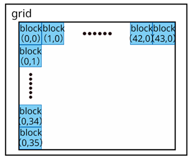
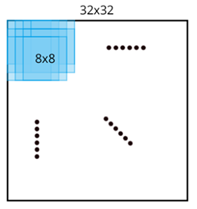

## 目录
#### - [优化说明](#optimization)
- [version 1.0](#v1)
- [version 2.0](#v2)
- [version 2.1](#v2.1)
#### - [优化结果](#result)
#### - [执行指令](#shell)

<div id="optimization"> </div>

## 优化说明

<div id="v1"> </div>

## version 1.0

**git commit id: 04f7a58e92082ce44f62bf746f1e0cb3910c58e2**

在优化作业中，我首先尝试以最简单的做法利用 GPU 并行加速 C63 编码器，作为 CUDA C 编程初次尝试。在此版本中，我将运动估计用到的当前帧、参考帧、每一宏块记录参考帧中最相似块位置的结构体 mbs (macroblock) 及其他参数从 host 传入 device，将设备的 Grid 划分为 (width/8, height/8) 个 Block，每个 Block 有 8\*8 个 Thread，以 352x288 大小的 forman 为例，如图1所示：



图1 以 forman 为例 GPU 使用示意图

即一个 Grid 处理一张图像大小的数据，每个 Block 对一个宏块与参考帧求 SAD（绝对差的总和）。global 函数中以循环的形式遍历参考帧中的宏块寻找最相似的宏块，因此程序仍需要约 (me\_search\_range \* 2)^2 次数的串行 SAD 操作。在运动估计 kernel（核函数） 中，关键操作如下：

```c
int mb_x = blockIdx.x;
int mb_y = blockIdx.y;

for (y=top; y<bottom; ++y)
{
    for (x=left; x<right; ++x)
    {
        __shared__ uint8_t sad_block[8][8];

        int row = blockIdx.y*blockDim.y+threadIdx.y;
        int col = blockIdx.x*blockDim.x+threadIdx.x;
        
        sad_block[threadIdx.y][threadIdx.x] = abs(*(orig+row*w+col) - 
                                              *(ref+(y+threadIdx.y)*w+x+threadIdx.x));
        
        // 同步点：等待所有线程完成数据计算
        __syncthreads();
        int i,j;
        int sad = 0;

        for (i=0; i<8; ++i)
        {
            for (j=0; j<8; ++j)
                sad += sad_block[i][j];
        }

        if (sad < best_sad)
        {
            mb->mv_x = x - mx;
            mb->mv_y = y - my;
            best_sad = sad;
        }
    }
}
```

数据拷贝和核函数调用的主要操作如下：

```c
extern "C" void me_block_cuda(struct c63_common *cm, uint8_t *orig_host, uint8_t *ref_host, int cc)
{
    struct macroblock *mbs;
    uint8_t *orig, *ref;
    
    ...
        
    cudaMalloc((void **)&mbs, size_mbs);
    cudaMalloc((void **) &orig, size_orig);
    cudaMalloc((void **) &ref, size_ref);
    // cudaMemcpy(mbs, cm->curframe->mbs[cc], size_mbs, cudaMemcpyHostToDevice);
    cudaMemcpy(orig, orig_host, size_orig, cudaMemcpyHostToDevice);
    cudaMemcpy(ref, ref_host, size_ref, cudaMemcpyHostToDevice);

    int grid_x = cc>0 ? cm->mb_cols/2:cm->mb_cols;
    int grid_y = cc>0 ? cm->mb_rows/2:cm->mb_rows;
    dim3 dimGrid(grid_x, grid_y);
    dim3 dimBlock(8,8);

    me_kernel<<<dimGrid, dimBlock>>>(cm->padw[cc], cm->padh[cc], mbs, 
                                    cm->me_search_range, orig, ref, cc);
    cudaMemcpy(cm->curframe->mbs[cc], mbs, size_mbs, cudaMemcpyDeviceToHost);

    cudaFree(mbs);
    cudaFree(orig);
    cudaFree(ref);
}
```

经测试，在这一版代码优化后，对 foreman 文件的处理时间由 35.06s 左右缩短为 15.49s，加速约 2.26 倍；对 tractor 文件的处理时间由 1759.43s 左右缩短为 704.80s，加速约 2.50 倍，文件解码后 psnr 分别为 36.62 和 39.42，对 tractor 文件而言 psnr 略有下降，可能是编码过程中造成的些微误差。利用 nvprof 工具可以看到如下结果：

```shell
==27503== Profiling application: ./c63enc -w 352 -h 288 -o tmp/FOREMAN_352x288_30_orig_01.c63 /home/FOREMAN_352x288_30_orig_01.yuv
==27503== Profiling result:
Time(%)      Time     Calls       Avg       Min       Max  Name
 99.82%  11.7943s       891  13.237ms  2.2198ms  35.740ms  me_kernel(int, int, macroblock*, int, unsigned char*, unsigned char*, int)
  0.15%  18.194ms      1782  10.209us  5.4400us  28.672us  [CUDA memcpy HtoD]
  0.03%  3.0515ms       891  3.4240us  2.8160us  12.928us  [CUDA memcpy DtoH]

==27503== API calls:
Time(%)      Time     Calls       Avg       Min       Max  Name
 94.09%  11.8940s      2673  4.4497ms  17.819us  35.768ms  cudaMemcpy
  4.07%  514.13ms      2673  192.34us  5.2330us  256.77ms  cudaMalloc
  1.68%  211.95ms      2673  79.293us  8.5030us  240.43us  cudaFree
  0.14%  18.064ms       891  20.273us  16.660us  70.511us  cudaLaunch
  0.01%  1.7381ms      6237     278ns     168ns  14.858us  cudaSetupArgument
  0.01%  972.22us       166  5.8560us     245ns  214.43us  cuDeviceGetAttribute
  0.00%  597.45us       891     670ns     487ns  12.756us  cudaConfigureCall
  0.00%  161.76us         2  80.881us  58.010us  103.75us  cuDeviceTotalMem
  0.00%  90.792us         2  45.396us  43.837us  46.955us  cuDeviceGetName
  0.00%  4.7840us         2  2.3920us  1.0270us  3.7570us  cuDeviceGetCount
  0.00%  2.0290us         4     507ns     284ns     714ns  cuDeviceGet
```

由于 kernel 的调用是异步的，调用 kernel 后不久主机线程就会获得控制，这样一来下一个 cudaMemcpy 会在 kernel 完成执行前启动。 而 cudaMemcpy 会阻塞等待 kernel 的结果，直到 kernel  执行结束才进行数据传输并返回。如图2所示：


图2 核函数和 cudaMemcpy 调用示意

因此在以上结果中 API calls 显示 cudaMemcpy 占用了相近于 Profiling result 中核函数调用的时间，就是因为 cudaMemcpy 阻塞了将近一整个核函数执行的时间。从 Profiling result 的结果可以看出，核函数执行的时间一共为 11.7943s 用了绝大部分，而数据传输事实上只有几个毫秒。

在这一版本中，数据处理的并行度较低，利用的 GPU 计算资源较少，导致 CPU 存在非常大的性能浪费。目前瓶颈仍非常明显地在计算部分，而非数据传输。因此需要考虑更好的并行化方法。

此外，注意到代码中有一行注释行：

```c
// cudaMemcpy(mbs, cm->curframe->mbs[cc], size_mbs, cudaMemcpyHostToDevice);
```

一开始，将每一宏块记录参考帧中最相似块位置的结构体 mbs (macroblock) 也传输到了 GPU 中，但后来认识到 GPU 的数据处理过程中，并不需要 mbs 的原本，只需要开辟存储它的空间及标识它的名字，因此取消了对它的拷贝。在注释掉这行之后，cudaMemcpy 的调用次数由之前的 3564 减少为现在的 2673，对计算结果没有影响。虽然确实存在优化，但由于前文所述，数据传输不是目前的瓶颈，而且占用的时间非常少，对时间结果而言，这个优化带来的影响几乎不可见。

<div id="v2"> </div>

## version 2.0

**git commit id: e86fd841ab7abda00cd58b64d3a8c6e07dfb7237**

这一版本中修改了数据并行的方式，提高了数据的并行度。考虑到每个 Block 最多 1024 个线程，且仅块内线程能比较容易地实现数据共享，而 SAD 操作中不仅需要将 8\*8 的数据块逐差累加，还需要对比参考帧中当前宏块附近的宏块计算得到的 SAD 值以找出最相近的块，当取 16 为搜索步长时，将至多处理 32\*8\*32\*8 个数据。理想情况下需要在块内开启  32\*8\*32\*8 = 65536 个线程对数据并行处理，但由于块内线程数限制，不具有可行性；而通过进一步增加 Block 数量实现的并行会带来关联数据共享（主要是 SAD 比较）的麻烦。

因此在 v2.0 中，我依然将 Grid 划分为 (width/8, height/8) 个 Block，而每个 Block 使用 32\*32 = 1024 个线程，每个线程计算一个宏块与它附近一个宏块之间的 SAD，此时一个线程内存在 8\*8 次的串行操作。如图 3 所示，黑色外框为当前帧一个宏块在参考帧中可能搜索的范围，浅蓝色小框为 Block 中每一个线程处理参考帧的图像范围。由于图像的边界，有些宏块运动估计搜索的宏块数少于 1024，此时根据实际搜索的数量，Block 内部分线程将提前结束。代码中使用 32\*32 大小的共享存储器交换各个线程（即参考帧宏块）计算得到的 SAD，并从中选出最相似的宏块。



图3 运动估计搜索示意

核函数代码如下：

```c
__global__ void me_kernel(int padw, int padh, struct macroblock *mbs, int me_search_range, uint8_t *orig, uint8_t *ref, int cc)  
{
    __shared__ int sads[16*2][16*2];
    __shared__ int best_sad;
    sads[threadIdx.y][threadIdx.x] = 0;
    best_sad = INT_MAX;

    int mb_x = blockIdx.x;
    int mb_y = blockIdx.y;
    
    ...
        
    int row = blockIdx.y*8;
    int col = blockIdx.x*8;

    int i,j;
    for (i=0; i<8; ++i)
    {
        for (j=0; j<8; ++j)
        {
            int result = abs(*(orig+(row+i)*w+col+j) - 
                             *(ref+(top+threadIdx.y+i)*w+left+threadIdx.x+j));
            atomicAdd(&sads[threadIdx.y][threadIdx.x], result);
        }
    }

    // 找出小的sad值
    atomicMin(&best_sad, sads[threadIdx.y][threadIdx.x]);
    __syncthreads();

    // 找出最相似的参考块
    for (i=0; i<(bottom-top); ++i)
    {
        for (j=0; j<(right-left); ++j)
        {
            if (sads[i][j] == best_sad)
            {
                mb->mv_x = left + j - mx;
                mb->mv_y = top + i - my;
                i = bottom-top;
                break;
            }
        }
    }
    mb->use_mv = 1;
}  
```

经测试，在这一版代码优化后，对 foreman 文件的处理时间为 6.96s，加速约 5.04 倍；对 tractor 文件的处理时间由为 278.39s，加速约 6.32 倍，文件解码后 psnr 分别为 36.62 和 39.43，与原版编码器得到的结果相同。利用 nvprof 工具可以看到如下结果：

```shell
==17506== Profiling application: ./c63enc -w 352 -h 288 -o tmp/FOREMAN_352x288_30_orig_01.c63 /home/FOREMAN_352x288_30_orig_01.yuv
==17506== Profiling result:
Time(%)      Time     Calls       Avg       Min       Max  Name
 99.17%  3.50949s       891  3.9388ms  1.1101ms  12.460ms  me_kernel(int, int, macroblock*, int, unsigned char*, unsigned char*, int)
  0.74%  26.115ms      1782  14.654us  5.4400us  28.481us  [CUDA memcpy HtoD]
  0.09%  3.1170ms       891  3.4980us  2.8160us  11.872us  [CUDA memcpy DtoH]

==17506== API calls:
Time(%)      Time     Calls       Avg       Min       Max  Name
 80.76%  3.61036s      2673  1.3507ms  31.686us  12.482ms  cudaMemcpy
 12.71%  568.03ms      2673  212.51us  5.3340us  239.58ms  cudaMalloc
  6.05%  270.27ms      2673  101.11us  8.7620us  265.13us  cudaFree
  0.39%  17.541ms       891  19.686us  16.582us  53.811us  cudaLaunch
  0.04%  1.7320ms      6237     277ns     172ns  62.732us  cudaSetupArgument
  0.02%  1.1129ms       166  6.7040us     299ns  268.08us  cuDeviceGetAttribute
  0.01%  570.66us       891     640ns     499ns  3.0340us  cudaConfigureCall
  0.01%  402.48us       891     451ns     339ns  12.863us  cudaGetLastError
  0.00%  146.78us         2  73.390us  63.445us  83.336us  cuDeviceTotalMem
  0.00%  110.29us         2  55.145us  51.847us  58.444us  cuDeviceGetName
  0.00%  5.6030us         2  2.8010us  1.0330us  4.5700us  cuDeviceGetCount
  0.00%  2.9770us         4     744ns     416ns  1.3210us  cuDeviceGet
```

可见核函数的运行时间被极大地压缩了，v2.0 比起 v1.0 具有很大程度的提升。除此之外，由于数据处理的并行化程度与视频分辨率，即每一帧的图像大小相关，而数据传输远远不是目前的瓶颈，因此对分辨率更高的 tractor 文件相比于低分辨率的 foreman 文件获得了更高的加速比，尤其是在更高程度并行化的 v2.0 中，两者之差体现得更为明显，这也体现了 GPU 更适合对大批量的数据进行并行处理，且数据量越大，加速效果越明显。

<div id="v2.1"> </div>

## version 2.1

原本由于图 3 中观察到 v2.0 访问参考帧的数据时有非常大量的数据被重复访问，因此考虑每个 Block 将 32\*32 大小的参考帧数据放入共享存储器以加速数据的读取。但在实际操作中发现效果并不理想，进一步了解到对共享存储器的访问存在 bank conflict，若有 x 个同一 warp 的线程同时访问一个 bank，则其访问速度将下降到 1/x。而根据我 v2.0 的操作方法，若使用共享存储器，将存在非常大量的 bank conflict，使数据读取速度不加反减，因此最终放弃了使用共享存储器的做法。

而在 review 代码的过程中，发现找出最相似参考块的过程存在串行冗余，因此将代码修改如下：

```c
// 找出最相似的参考块
if (sads[threadIdx.y][threadIdx.x] == best_sad)
{
    mb->mv_x = left + threadIdx.x - mx;
    mb->mv_y = top + threadIdx.y - my;
}
```

由于在前面的代码中已经通过原子操作和线程同步获得了 best_sad 的最小值，因此只需要每个线程各自对比自己的 best_sad 是不是最小值来决定要不要给 mb 的运动向量赋值就行了，并不需要再通过循环寻找 best_sad。在 v2.1 的优化后，对 foreman 文件的处理时间为 5.05s，加速约 6.94 倍；对 tractor 文件的处理时间由为 182.83s，加速约 9.62 倍，文件解码后 psnr 分别为 36.62 和 39.43，与原版编码器得到的结果相同。

<div id="result"> </div>

## 优化结果

由于 gprof 工具无法记录 GPU 调用的时间，因此本次实验仍采用 clock 方法在程序始末添加时钟计算程序执行的总时间。本表格中，运行时间为在服务器上连续运行十次取平均值，使用的显卡为 Tesla K20c。

|  优化内容   | time(foreman) | time(tractor) | PSNR(foreman) | PSNR(tractor) |
| :---------: | :-----------: | :-----------: | :-----------: | :-----------: |
|  原始代码   |     35.06     |    1759.43    |     36.62     |     39.43     |
| version 1.0 |     15.49     |    704.80     |     36.62     |     39.42     |
| version 2.0 |     6.96      |    278.39     |     36.62     |     39.43     |
| version 2.1 |     5.05      |    182.83     |     36.62     |     39.43     |
|             |               |               |               |               |
|             |               |               |               |               |
|             |               |               |               |               |

<div id="shell"> </div>

## 执行指令

**compile**

```shell
$ make
```

**encode**

```shell
$ nvprof ./c63enc -w 352 -h 288 -o tmp/FOREMAN_352x288_30_orig_01.c63 /home/FOREMAN_352x288_30_orig_01.yuv
$ nvprof ./c63enc -w 1920 -h 1080 -o tmp/1080p_tractor.c63 /home/1080p_tractor.yuv
```

**decode**
```shell
$ ./c63dec tmp/FOREMAN_352x288_30_orig_01.c63  tmp/foreman.yuv
$ ./c63dec tmp/1080p_tractor.c63  tmp/tractor.yuv
```

**play the raw yuv file**

```shell
$ vlc --rawvid-width 352 --rawvid-height 288 --rawvid-fps 30 --rawvid-chroma I420 tmp/foreman.yuv
$ vlc --rawvid-width 1920 --rawvid-height 1080 --rawvid-fps 30 --rawvid-chroma I420 tmp/tractor.yuv
```

**psnr**
```shell
~/Downloads/evalvid/psnr 1920 1080 420 ~/Desktop/codec63-ori/codec63/video/1080p_tractor.yuv ~/Desktop/codec63-ori/codec63/tmp/tractor.yuv
~/Downloads/evalvid/psnr 352 288 420 ~/Desktop/codec63-ori/codec63/video/FOREMAN_352x288_30_orig_01.yuv ~/Desktop/codec63-ori/codec63/tmp/foreman.yuv
```

**time account**
```shell
$ gprof c63enc gmon.out -p
$ nvprof --print-gpu-trace ./c63enc -w 352 -h 288 -o tmp/FOREMAN_352x288_30_orig_01.c63 /home/FOREMAN_352x288_30_orig_01.yuv
```